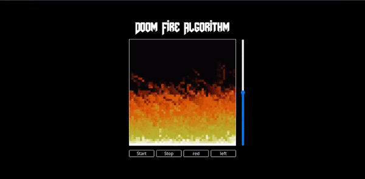

# Doom fire algorithm

## Sobre
Desenvolvi um projeto baseado no vídeo do Filipe Deschamps, onde ele implementa o algoritmo do fogo do doom utilizando uma tabela HTML. No entanto, decidi implementar o mesmo algoritmo utilizando o elemento canvas do HTML, que permite renderizar elementos complexos de forma mais eficiente. Com essa abordagem, foi possível aumentar a área do fogo e adicionar controladores para criar novas interações, como mudança de cor, altura e direção do vento.

